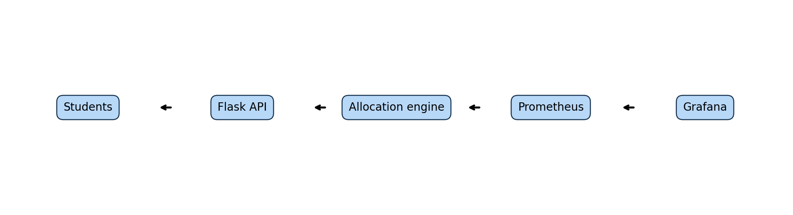
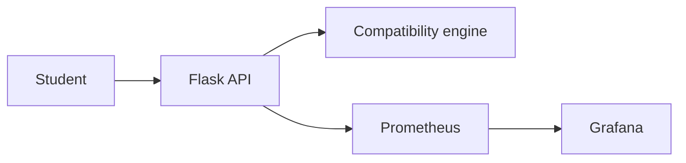

# RoomFit allocation service

RoomFit is a Python microservice that allocates compatible hostel roommates while enforcing gender, smoking, alcohol, and room size constraints.





## Tasks delivered

| Task | What is delivered | Where |
| --- | --- | --- |
| Pipeline | GitHub Actions test, security, image, Kind deploy | `.github/workflows/pipeline.yml` |
| Configuration | Idempotent Ansible playbook and templates | `ansible/` |
| Runtime | Docker and Kubernetes rolling update files | `Dockerfile`, `k8s/`, `scripts/` |
| Monitoring | Prometheus, Grafana, alerts, load scripts | `monitoring/` |
| Reflection | Case studies, five slides, evidence checklist | `docs/` |

## Stack

| Layer | Technology |
| --- | --- |
| API | Python 3.12, Flask, Gunicorn |
| Metrics | Prometheus Flask exporter |
| Delivery | GitHub Actions, Docker, Kind, Kubernetes |
| Operations | Ansible, Prometheus, Grafana |

## API

| Method | Path | Purpose |
| --- | --- | --- |
| GET | `/health` | Liveness and version |
| GET | `/ready` | Readiness |
| GET | `/api/v1/sample` | Twelve student allocation sample |
| POST | `/api/v1/compatibility` | Score two students |
| POST | `/api/v1/validate` | Validate a proposed room |
| POST | `/api/v1/allocate` | Allocate a student list |

Run locally with `python -m pip install -r requirements-dev.txt`, then `python -m flask --app app.main run`. Example: `curl http://localhost:5000/health`.

## Commands

Run checks with `python -m flake8 app tests` and `python -m pytest --cov=app --cov-fail-under=85`.

Run monitoring with `docker compose up --build`. Run a rolling update in PowerShell with `scripts/rolling-update-demo.ps1`. Run Ansible from WSL using the command in `ansible/README.md`.

The pipeline runs test and security for pull requests. Main branch pushes add image build, Kind deployment, and a smoke test.

## Structure

```text
app/          API and allocation engine
tests/        Unit and API tests
k8s/          Kubernetes objects
ansible/      Host configuration
monitoring/   Prometheus, Grafana, alerts
docs/         Case studies, slides, evidence
```

## Learning notes

Hard constraints are checked before scoring. Health probes, replicas, least privilege, rolling updates, and rollback make delivery safer. Metrics make uptime, latency, errors, and allocation activity visible. Read the case study answers in `docs/RoomFit_DevOps_Case_Studies.docx`.
