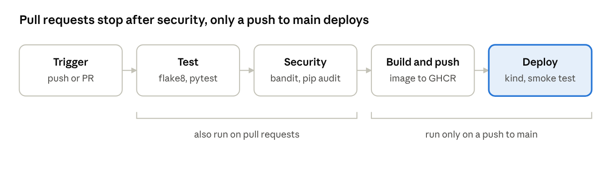
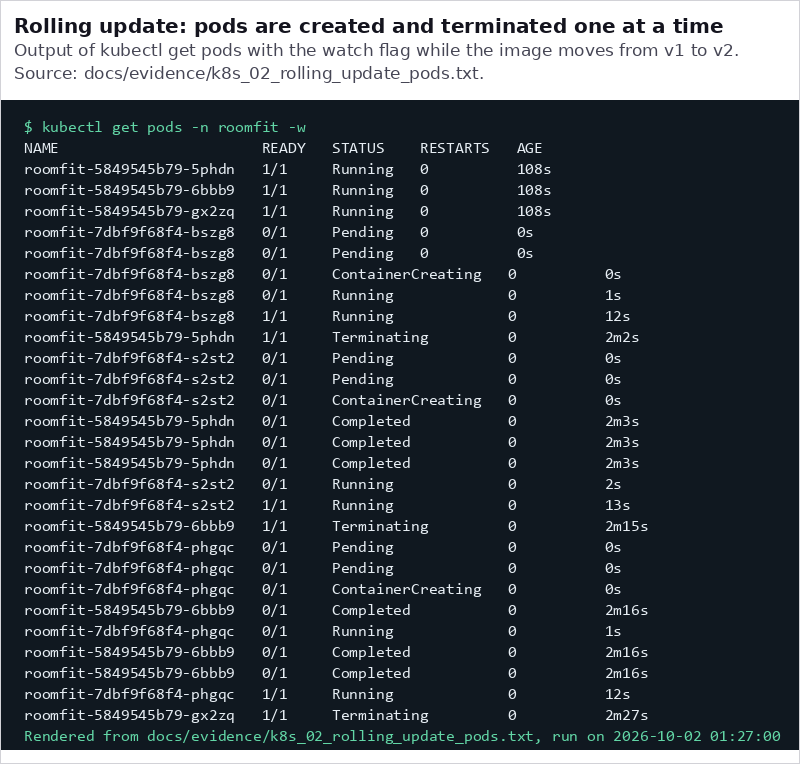
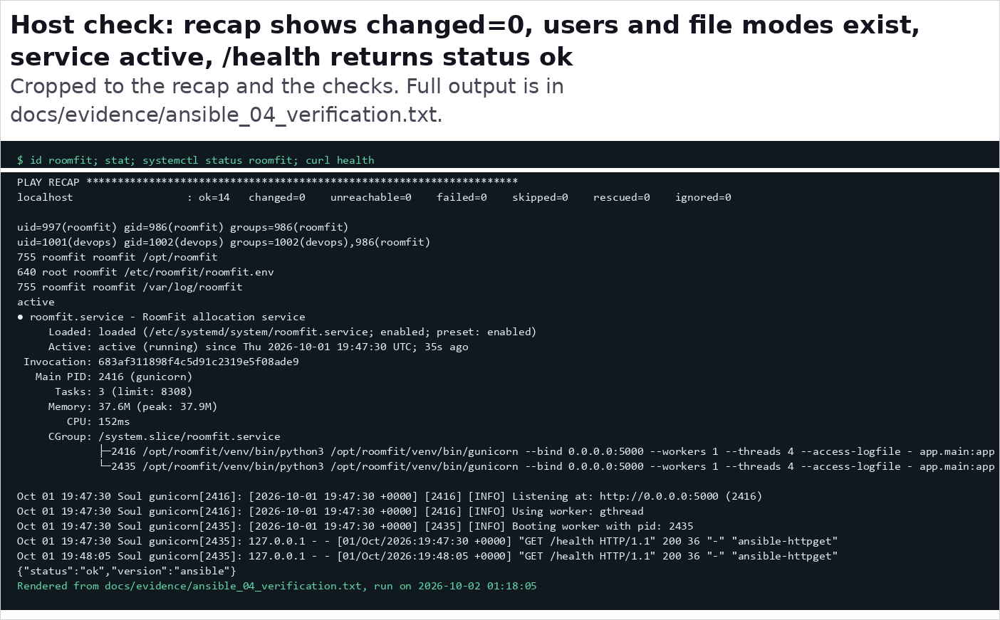
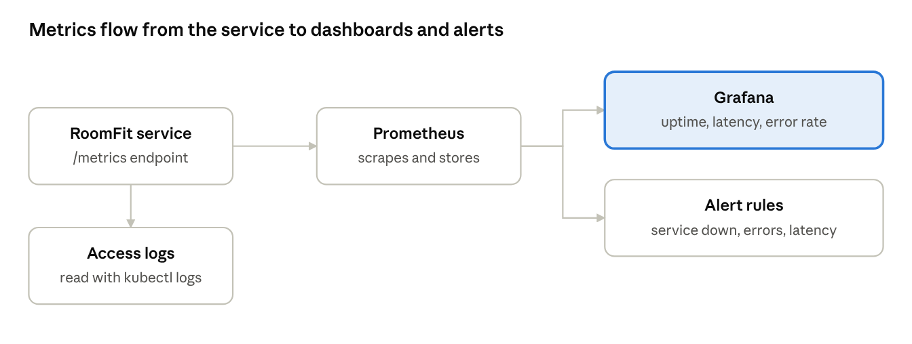
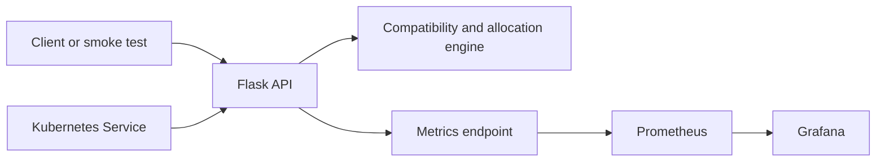

# RoomFit DevOps Case Study

[](https://github.com/Bitsnbytes14/devops-case-study/actions/workflows/pipeline.yml)

RoomFit is a Python 3.12 Flask allocation API. It evaluates gender, smoking, alcohol, room size, age, course, year, and budget constraints, then returns compatible room allocations. This repository is a self-contained CA II submission with executable delivery, configuration, Kubernetes, and monitoring evidence.


## Submission map

| CA II area | Repository implementation | Documentation and evidence |
| --- | --- | --- |
| CI/CD pipeline | GitHub Actions runs lint, tests, Bandit, pip-audit, and an image build; Kind deployment is reproducible locally | [Pipeline guide](docs/ci-pipeline.md) and [pipeline diagram](docs/diagrams/ca-ii-reference/page-6-1.png) |
| Ansible configuration | Idempotent systemd deployment with a dedicated `roomfit` user, virtual environment, environment file, and log rotation | [Ansible guide](docs/ansible-deployment.md) and [evidence](docs/evidence/ansible_04_verification.txt) |
| Container and Kubernetes delivery | Hardened container, three replicas, probes, resource limits, rolling update, and rollback | [Kubernetes guide](docs/k8s-deployment.md) and [rollout evidence](docs/evidence/k8s_03_rollout_history.txt) |
| Monitoring and incident simulation | Prometheus, Grafana, alert rule, controlled faults, and recovery | [Monitoring guide](docs/monitoring.md) and [chaos evidence](docs/evidence/monitoring_03_chaos.txt) |
| Architecture and reflection | Service design, Netflix and Amazon case-study material, and a five-slide summary | [Architecture](docs/architecture.md) and [reflection report](docs/reflection-report.md) |

## CA II reference diagrams

The following images are extracted from the supplied CA II brief so that the report and repository use the same visual presentation. They are reference illustrations, not claims that RoomFit contains the unrelated frontend, Node, or MongoDB platform shown in the full-platform diagram.

### Delivery pipeline



The CA II diagram presents the target sequence: **Trigger → Test → Security → Build and push → Deploy**. The repository workflow runs the first four stages, with deployment demonstrated locally through the reproducible Kind script and recorded evidence. Pull requests stop after security; only pushes to `main` build and publish the image.

### Rolling update evidence



The local Kind verification deployed `roomfit-api:v1`, updated to `roomfit-api:v2`, and rolled back to `v1` while maintaining three Ready replicas. See the [pod transition capture](docs/screenshots/term_k8s_rolling_update.png).

### Ansible idempotence evidence



The second Ansible run reports `changed=0` and `failed=0`; the service check confirms the account, permissions, active systemd service, and `/health` response.

### Monitoring flow



RoomFit exposes `/metrics`; Prometheus scrapes it and feeds the Grafana dashboard and alert rule. The verified fault injection result is 155 successful requests, 45 failures, and a 22.28% error rate before recovery.

## Architecture implemented here



This standalone repository deliberately implements the allocation API and its operational stack. It does not represent the separate multi-service web application included as an example in the supplied PDF.

## API

| Method | Path | Purpose |
| --- | --- | --- |
| GET | `/health` | Liveness and image version |
| GET | `/ready` | Readiness check |
| GET | `/metrics` | Prometheus metrics |
| GET | `/api/v1/sample` | Twelve-student allocation sample |
| POST | `/api/v1/compatibility` | Score two students |
| POST | `/api/v1/validate` | Validate a proposed room |
| POST | `/api/v1/allocate` | Allocate a student list |

## Run and verify

Install development dependencies and start the API:

```powershell
py -m pip install -r requirements-dev.txt
py -m flask --app app.main run
curl http://localhost:5000/health
```

Run code quality and test gates:

```powershell
py -m flake8 app tests
py -m pytest --cov=app --cov-fail-under=85
bandit -r app
pip-audit -r requirements.txt
```

Start the monitoring stack with `docker compose up --build`. Run the local Kubernetes demonstration with `scripts/rolling-update-demo.ps1`. Run host configuration through WSL using the command in [ansible/README.md](ansible/README.md).

## CI status and evidence integrity

The repository has local evidence for passing lint, test, security, image, deployment, monitoring, and rollback checks. GitHub Actions intentionally runs only the reliable hosted checks: test, security, and image build. The Kind rollout and rollback remain reproducible locally through [scripts/rolling-update-demo.ps1](scripts/rolling-update-demo.ps1) and the linked Kubernetes evidence.

## Repository layout

```text
app/          Flask API, compatibility rules, and allocation engine
tests/        Unit and API tests
.github/      GitHub Actions pipeline
ansible/      Idempotent host configuration and systemd templates
k8s/          Deployment, Service, ConfigMap, and namespace manifests
monitoring/   Docker Compose, Prometheus, Grafana, and alert configuration
scripts/      Reproducible demonstration and evidence-capture scripts
docs/         CA II guides, reports, diagrams, screenshots, and evidence
```

## Supporting documents

[CI/CD pipeline](docs/ci-pipeline.md) · [Ansible deployment](docs/ansible-deployment.md) · [Kubernetes deployment](docs/k8s-deployment.md) · [Monitoring](docs/monitoring.md) · [Autoscaling scope](docs/autoscaling.md) · [Architecture](docs/architecture.md) · [Reflection report](docs/reflection-report.md) · [Evidence index](docs/screenshots/README.md)
